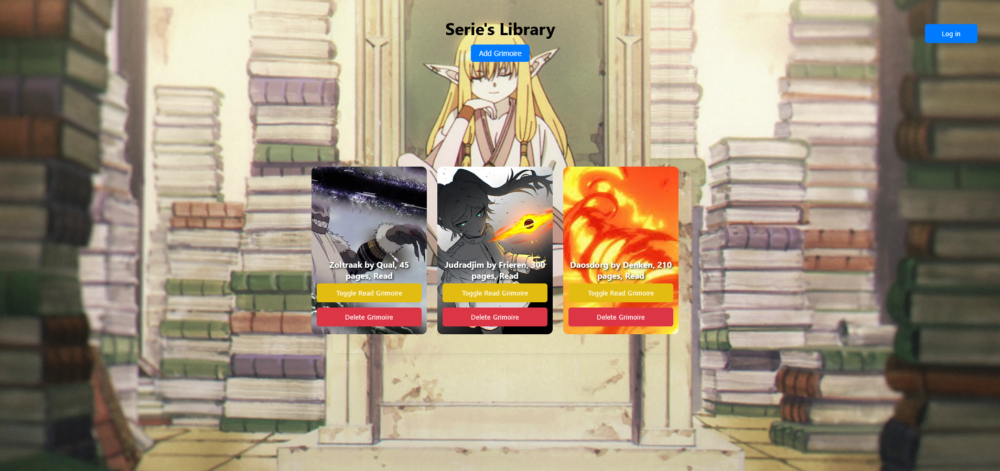
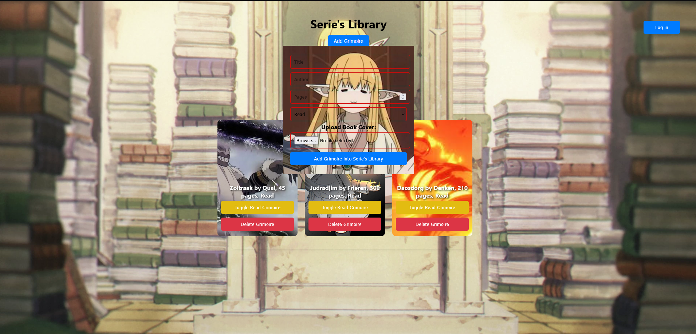

# Project Title: React Library Manager

## Description
React Library Manager is a web application that allows users to add, manage, and remove books from a virtual library. The application provides a user-friendly interface for organizing a personal or shared book collection.

## Screenshots




## Technologies Used
- React.js
- JavaScript (ES6+)
- HTML & CSS
- Node.js & npm
- Webpack

## Features Implemented
### Required Features:
- Add new books with title, author, and genre
- View a list of all books
- Delete books from the collection
- Toggle read function

### Additional Features:
- Built as a React app
- Added a login button
- Added book covers/images that users can upload to display books

## Installation Instructions
1. Clone the repository:
   ```sh
   git clone https://github.com/yourusername/project2.git
   ```
2. Navigate to the project directory:
   ```sh
   cd project2
   ```
3. Install dependencies:
   ```sh
   npm install
   ```
4. Start the development server:
   ```sh
   npm start
   ```

## Usage Guidelines
- Open the application in your browser after running `npm start`.
- Use the form to add books.
- Click on a book to delete it from the list.
- Click on the toggle read function to toggle if you've read the book or not.

## Future Improvements Planned
- A search function to help look for certain books
- Dark mode toggle

## Learning Outcomes
- Improved React component structuring
- Gained experience with Css, Html, and JavaScript

## Link to Live Demo
[(https://rmclaughlin2022.github.io/Projectt2/)]

## Commit History
- I had a lot of trouble with react making my github have 37,000 files that didn't work and I tried rolling back it but it took too long so instead I created a new repository everytime that happened. (like 2 or 3 times) so thats why my Commit History is basically nonexistant.

---

For any issues or contributions, please submit a pull request or open an issue in the repository!

